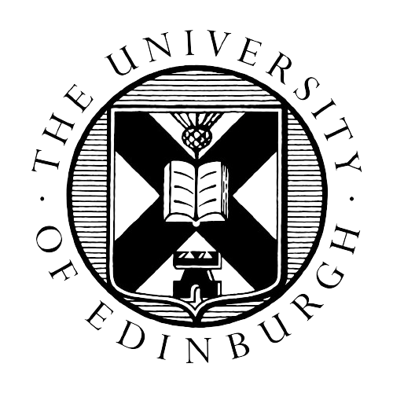

  

    <h3>August 2021 - July 2022</h3>
    
<strong>Master of Informatics (MInf)</strong> 
    <a href="https://www.ed.ac.uk/studying/undergraduate/degrees/index.php?action=view&code=G500">School of Informatics</a> 
    <a href="https://www.ed.ac.uk/">The University of Edinburgh (Edinburgh, UK)</a> 
    Advisor: <a href="https://homepages.inf.ed.ac.uk/rhill2/">Professor Robin Hill</a> 
    Thesis: <a href="#">Extractive text summarisation of Privacy Policy documents   using machine learning approaches</a>

    *Transferred from BSc Artificial Intelligence to MInf  
  

  

    
    
  

  

    <h3>September 2017 - June 2021</h3>
    
<strong>Artificial Intelligence (BSc)</strong> 
    <a href="https://informatics.ed.ac.uk/">School of Informatics</a> 
    <a href="https://www.ed.ac.uk/">The University of Edinburgh (Edinburgh, UK)</a>

    Advisor: <a href="https://homepages.inf.ed.ac.uk/rhill2/">Professor Robin Hill</a> 
    Advisor 2: <a href="https://homepages.inf.ed.ac.uk/dka/">Professor D K Arvind</a> 
  

